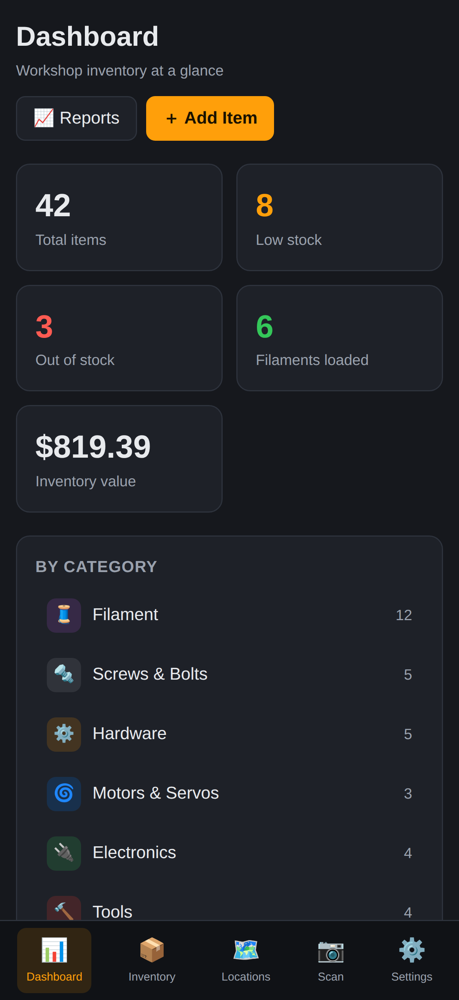
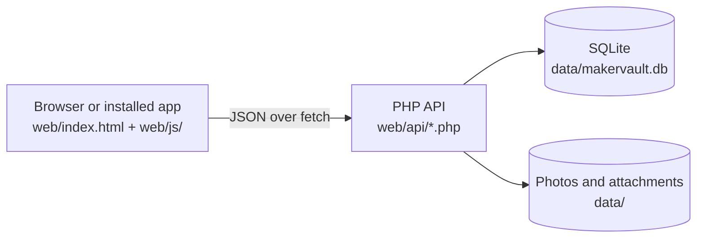

# MakerVault

[](https://github.com/bzayas/MakerVault/actions/workflows/ci.yml)

Self-hosted inventory for a maker's workshop: 3D printer filament, screws and hardware, electronics, tools and craft supplies, tracked down to the bin they live in. It runs on a Synology NAS and works from any phone or computer on the home network, including offline once installed.


<table>
  <tr>
    <td></td>
    <td></td>
    <td></td>
  </tr>
</table>

## What it does

- Keeps every item with its quantity, price, photo, attachments, custom fields and full change history. Pack prices are split into a per-unit cost so stock value is right.
- Models storage as a tree (rack, shelf, bin) with printable QR labels for every level.
- Tracks filament spools by material and color, and which AMS slot each one is loaded in.
- Designs and prints labels with barcodes and QR codes, and exports Bambu Suite print-then-cut files.
- Scans barcodes and QR labels with the phone camera, including an audit mode for counting stock.
- Imports Bambu Lab and Amazon invoice PDFs, store product pages and CyberBrick kits, and checks Makerworld parts lists against what's on the shelf.
- Reports inventory value and monthly spending, and finds duplicate items to merge.

<table>
  <tr>
    <td></td>
    <td></td>
  </tr>
  <tr>
    <td></td>
    <td></td>
  </tr>
</table>

More screens in the [user guide](docs/user-guide.md).

## How it's built

A static single-page app in plain JavaScript, a PHP API with one file per resource, and one SQLite database. No build step, no framework, no dependencies to install.



Details in [docs/architecture.md](docs/architecture.md).

## Run it locally

You need PHP 8 with the `pdo_sqlite` and `gd` extensions. Node is optional (for the parser tests).

```sh
git clone https://github.com/bzayas/MakerVault.git
cd MakerVault
php -S 127.0.0.1:8743 -t web
```

Open http://127.0.0.1:8743. The first request creates an empty database in `web/data/`. To fill it with demo data, run `python3 scripts/screenshots/seed_demo.py http://127.0.0.1:8743` against the empty instance.

Run the checks before committing:

```sh
scripts/check.sh
```

More in [docs/development.md](docs/development.md).

## Deploy to the NAS

```sh
scripts/bump-version.sh 3.15.0-beta   # every release
git commit -am "Release 3.15.0-beta" && git push
scripts/deploy.sh                      # --dry-run to preview
```

`deploy.sh` runs the checks, copies `web/` to the NAS without touching the live `data/` folder and confirms the new version is live. First-time Web Station setup is in [docs/deployment.md](docs/deployment.md).

## Documentation

| Document | Read it to |
|---|---|
| [User guide](docs/user-guide.md) | Learn every screen |
| [Architecture](docs/architecture.md) | See how the pieces fit |
| [Frontend modules](docs/frontend.md) | Find your way around `web/js/` |
| [API reference](docs/api.md) | Call or change an endpoint |
| [Database](docs/database.md) | Understand the tables and add a column |
| [Labels](docs/subsystems/labels.md), [Importing](docs/subsystems/importing.md), [Scanning](docs/subsystems/scanning.md), [Offline and updates](docs/subsystems/offline-and-updates.md) | Work on one of the larger subsystems |
| [Development](docs/development.md) | Set up, test and release |
| [Deployment](docs/deployment.md) | Install on Synology Web Station |
| [Known issues](docs/known-issues.md) | See what's broken or limited |
| [Roadmap](ROADMAP.md) | See what's next |
| [Changelog](CHANGELOG.md) and [history](docs/history.md) | See what changed and why |

## Status

Beta, in daily use in one workshop. Version 3.14.0-beta, with more work merged since (see the [changelog](CHANGELOG.md#unreleased)). It was ported from a native SwiftUI app in July 2026 and replaced it completely.
