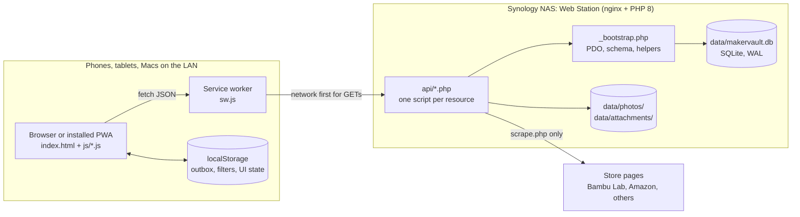
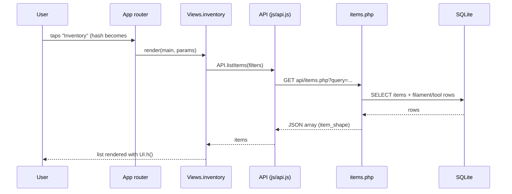
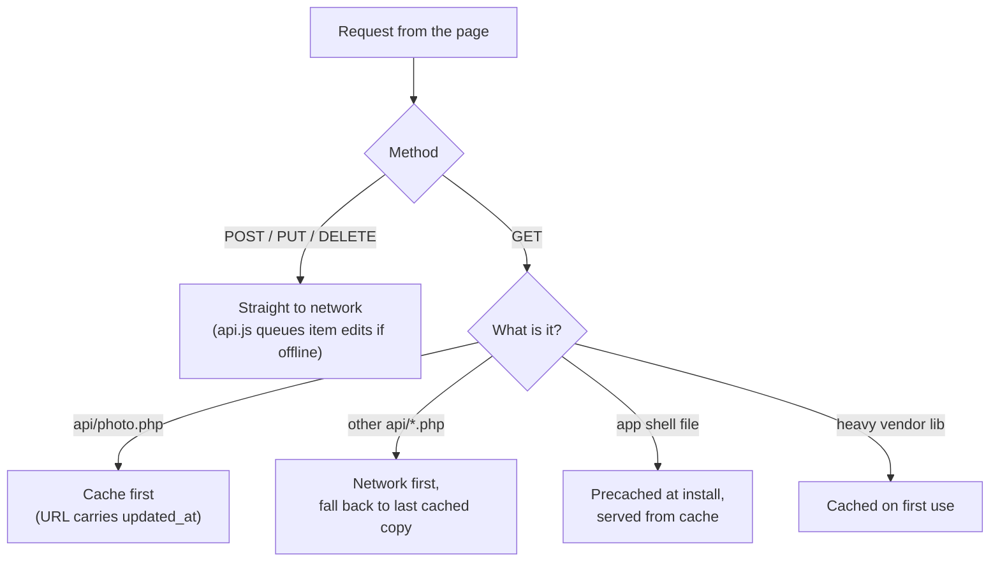
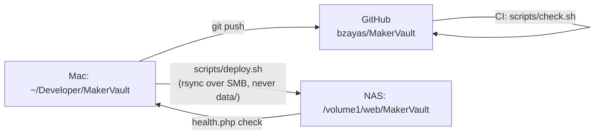

# Architecture

MakerVault is a single-page web app backed by a small PHP API and one SQLite file. Everything runs inside Synology Web Station on the home NAS. There is no build step, no framework, no package manager and no background worker. A browser loads static files, the JavaScript calls PHP scripts over JSON, and the PHP scripts read and write `data/makervault.db`.

This page explains how those parts connect. For the file-by-file detail, see [frontend.md](frontend.md), [api.md](api.md) and [database.md](database.md).

## The big picture



The server is the single source of truth. Every device reads the same database, so there is no sync layer between devices. The only client-side copy of data is the service worker's cache of recent GET responses (for offline viewing) and a small outbox of item edits made while offline.

## Request flow

A normal page view goes through four steps:

1. `index.html` loads the stylesheet and every script in a fixed order. Each script defines one global object (`API`, `UI`, `App`, `LabelGen`, `InvoiceParsers`, `LabelExport`) or registers a view on `window.Views`.
2. `App.boot()` fetches the categories and the location tree once and keeps them in `App.state`. Most views need both.
3. The hash router reads `location.hash` (for example `#/inventory?category=filament`), finds `Views.inventory` and calls `render(main, { category: 'filament' })`.
4. The view calls methods on `API`, which wraps `fetch()` against `api/<resource>.php` and returns parsed JSON.



Writes follow the same path with POST, PUT or DELETE. Every write that changes an item also inserts a row into `activity_log` on the server, inside the same request.

## Frontend

The frontend is plain JavaScript in the browser's global scope. Each file wraps its code in an IIFE and exposes one object. The order of the `<script>` tags in `index.html` is the dependency order: `api.js` and `ui.js` come first, `app.js` comes last.

Views are objects with a `render(main, params)` method and an optional `cleanup()` (the scanner uses it to release the camera). Views build DOM with `UI.h()`, a small hyperscript helper:

```js
h('div.item-row', { onclick: () => openDetail(item.id) },
  h('div.item-name', item.name),
  item.quantity === 0 ? h('span.badge', 'Out of stock') : null)  // null children are skipped
```

Heavy libraries load only when a screen needs them:

| Library | File | Loaded by | Used for |
|---|---|---|---|
| pdf.js | `js/vendor/pdf.min.js` + worker | Import view | Reading invoice PDFs |
| ZXing | `js/vendor/zxing.min.js` | Scanner, on iOS | Barcode decoding where `BarcodeDetector` is missing |
| SheetJS | `js/vendor/xlsx.min.js` | BOM view | Reading Makerworld `.xlsx` files |
| qrcode-generator | `js/vendor/qrcode.js` | Always (small) | QR codes on labels |

## API

Each resource is one PHP file under `web/api/`. A file starts with `require '_bootstrap.php'`, then switches on the HTTP method and a few query parameters. There is no router and no framework. The bootstrap gives every endpoint the same tools:

- `db()` opens SQLite with WAL mode, foreign keys and a 5 second busy timeout. On a fresh install it runs `schema.sql`. On an existing database it applies small, idempotent migrations (`ensure_column`).
- `respond($data, $code)` and `fail($message, $code)` send JSON and stop.
- `item_shape()` and `rows_to_items()` turn database rows into the JSON shape every item endpoint returns. They fetch filament and tool extension rows in bulk to avoid one query per item.
- `log_activity()` records what changed.

Most parsing happens in the browser, not in PHP. Invoice PDFs and BOM spreadsheets are read client-side, and the server only receives the cleaned rows. The exception is product-page scraping: browsers can't fetch other sites because of CORS, so `scrape.php` does it, with a guard against requests to private network addresses (which has a gap, see [known-issues.md](known-issues.md#security-and-privacy)).

## Data storage

| What | Where | Notes |
|---|---|---|
| Inventory, locations, printers, labels, activity | `data/makervault.db` | SQLite in WAL mode. Schema in `web/api/schema.sql`. |
| Item photos | `data/photos/<item-id>.jpg` | Resized to 1200 px max, JPEG quality 85, EXIF rotation applied. |
| Item attachments | `data/attachments/<item-id>/<file>` | Datasheets, manuals, STL/3MF/STEP files. Extension allowlist. |
| Offline edit queue | Browser `localStorage` (`mv-outbox`) | Per device. Replayed on reconnect. |
| Saved smart filters | Browser `localStorage` (`mv-smart-filters`) | Per device, not synced. |
| Label template choices, tree expand state | Browser `localStorage` | Per device conveniences. |

`data/` is the only folder that changes at runtime. It is excluded from git and from every deploy. See [database.md](database.md) for the tables.

## Offline support and updates

The service worker (`web/sw.js`) decides how to answer each request:



Installed copies of the app update themselves. The cache name contains `MV_SW_VERSION`. When a deploy changes that version, the browser installs the new worker, the worker deletes old caches, and `app.js` reloads the page once (unless a dialog is open or offline edits are waiting). `app.js` also asks for an update on launch, whenever the app returns to the foreground, and every hour. The full story, including why the version must change on every deploy, is in [subsystems/offline-and-updates.md](subsystems/offline-and-updates.md).

## Deployment



Code reaches the NAS by `rsync` from the Mac, run by `scripts/deploy.sh`. The script refuses to deploy changed files unless the service worker version went up, because installed clients would otherwise keep the old cache. Setup and the full checklist are in [deployment.md](deployment.md).

## Design decisions

These choices shape most of the code. Check the reason before reversing one.

| Decision | Why |
|---|---|
| No build step, no framework | The app is edited directly and copied to the NAS. Anything that needs a compiler adds a step that can break. Vanilla JS with `UI.h()` has been enough for about 7,300 lines of JavaScript and 3,900 lines of PHP. |
| SQLite on the server, not IndexedDB in the browser | One database means every device always agrees. The earlier Topps Binder project keeps data in each browser and syncs it through PHP. MakerVault doesn't need that layer at all. |
| Same schema as the original FastAPI server | The live database was copied straight from the native app in July 2026 with no export or import step. The schema still carries native-app columns such as `users` and `photo_data` for that reason. |
| Parsing in the browser | pdf.js and SheetJS are JavaScript libraries. Running them client-side keeps the PHP side small and lets the user review parsed rows before anything is saved. |
| Category icons stored as SF Symbol names | The native app used them. `UI.categoryIcon()` maps them to emoji so the database stays compatible. |
| Service worker added late (3.4.0) | Caching was skipped during early beta on purpose, because stale caches make every bug harder to verify. It went in once features settled, together with the self-update logic in 3.5.2. |
