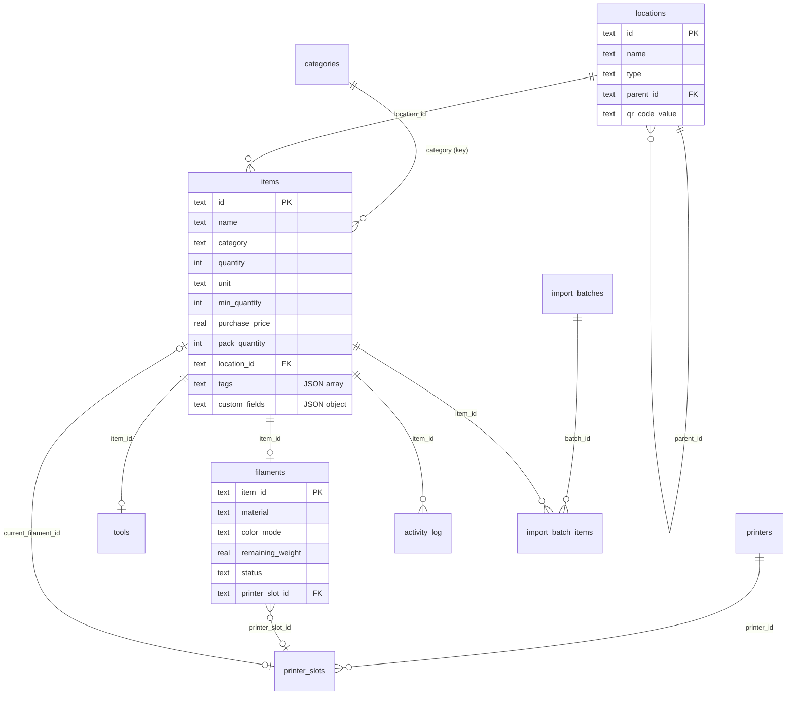

# Database

MakerVault stores everything in one SQLite file, `data/makervault.db`, next to the web root on the NAS. The schema is in [`web/api/schema.sql`](../web/api/schema.sql). It is the same schema the original native app's FastAPI server used, so the live database was copied over from the Mac in July 2026 without any conversion.

SQLite runs in WAL mode with foreign keys on and a 5 second busy timeout. WAL mode means the database is really three files: `makervault.db`, `makervault.db-wal` and `makervault.db-shm`. The web server user needs write access to the folder, not just the file.

## Tables at a glance



| Table | Holds |
|---|---|
| `items` | Every inventory item. The core table. |
| `filaments` | Extra fields for items in the `filament` category (one row per spool item). |
| `tools` | Extra fields for items in the `tool` category, including check-out state. |
| `categories` | The category list. `key` is what `items.category` stores. |
| `locations` | The storage tree. `parent_id` points to the parent location. |
| `printers`, `printer_slots` | Printers and their AMS and external slots, with the loaded filament. |
| `activity_log` | One row for every change. |
| `import_batches`, `import_batch_items` | Each invoice import and the line details for every item it touched. |
| `label_templates`, `label_presets` | Label designs and size presets. |
| `barcode_sequences` | The next number for each `MV-<PREFIX>-` barcode series. |
| `duplicate_dismissals` | Item pairs marked "not duplicates". |
| `users` | From the native app. Not used by the web app yet (see [ROADMAP.md](../ROADMAP.md)). |

## Items

Most columns mean what their names say. A few need explaining.

| Column | Meaning |
|---|---|
| `quantity`, `unit` | How many you have, in `pcs`, `packs`, `spools`, `sheets`, `sets`, `rolls`, `meters` or `grams`. |
| `min_quantity` | Low-stock threshold. An item is low when `quantity <= min_quantity`. |
| `purchase_price` | Exactly what the receipt said for one purchase. |
| `pack_quantity` | How many units that one price covered. Empty or 1 means the price is per unit. A $11.49 bag of 2,000 cork pads has `purchase_price = 11.49`, `pack_quantity = 2000`. |
| `purchase_date` | `YYYY-MM-DD`. Some older rows hold free text, which the reports skip. |
| `location_id` | Where the item is now. Cleared while a spool is loaded in a printer. |
| `home_location_id` | Where the item normally lives. Used to send spools back after unloading. |
| `whereabouts` | Free text for "in use" places such as "Workbench". |
| `tags` | JSON array of strings. |
| `custom_fields` | JSON object of label to value, for example `{"Hole size": "4.0 mm"}`. |
| `original_import_name` | The product name as it appeared on the invoice, before cleanup. Used for duplicate and BOM matching. |
| `photo_path` | Set when a photo exists in `data/photos/`. |
| `photo_data`, `created_by` | From the native app. Not written by the web app. |

Stock value is always computed the same way, in `dashboard.php`, `reports.php` and the item sheet:

```sql
SUM(purchase_price / MAX(1, COALESCE(pack_quantity, 1)) * quantity)
```

## Filaments

| Column | Values |
|---|---|
| `material` | Free text. The form offers the list in `FILAMENT_MATERIALS` (`js/inventory.js`). |
| `color_mode` | `solid`, `gradient`, `split`, `sparkle`, `silk`. Extra colors go in `color_hex2` to `color_hex4`. |
| `status` | `inStock`, `loadedInAMS`, `loadedExternal`, `inUse`, `empty`. |
| `spool_weight`, `remaining_weight` | Grams. Drives the remaining-filament meter. |
| `spool_type` | `withSpool` or `refill`. |
| `printer_slot_id` | The slot it is loaded in, if any. |

## Locations

A location has a `type` (shelf, drawer, Gridfinity bin, dry box and so on, listed in [api.md](api.md#locationsphp)) and an optional `parent_id`. Top-level locations have no parent. `qr_code_value` is what a location's QR label encodes, `makervault://location/<id>` by default, and is unique.

The API stops a location from becoming its own ancestor. Before 3.2.1 that check didn't exist, and a cycle could make recursive delete loop forever.

## Activity log

Every write through the API adds a row: `action`, `item_id`, `location_id`, a human-readable `details` string and a UTC `timestamp`. `user_id` is always empty for now, since the web app has no users yet. When an item is deleted its log rows stay, with `item_id` set to null by the foreign key.

## Migrations

There is no migration framework. `init_schema()` in `web/api/_bootstrap.php` runs on every request and applies small idempotent steps to existing databases. `ensure_column()` adds a column only if it is missing.

| Version | Change |
|---|---|
| (native app) | `items.original_import_name` (FastAPI migration 12), added if missing |
| 3.8.0 | `import_batch_items` gains `unit_price`, `list_price`, `line_total`, `discount`, `tax`, `quantity` |
| 3.9.0 | Items saved with the wrong category key `screw` are moved to `screws` |
| 3.12.0 | `items.custom_fields` |
| 3.13.0 | `duplicate_dismissals` table |
| 3.14.0 | `items.pack_quantity` |
| (printers.php) | `printer_slots.sort_order`, added the first time the printers endpoint runs |

On a brand new install, `schema.sql` creates everything, then the categories and four label size presets are seeded.

To add a column:

1. Add it to `schema.sql` so new installs get it.
2. Add an `ensure_column()` call in `init_schema()` so existing databases get it.
3. Add it to `item_shape()` (if it belongs on items), `backup.php` export and restore, and the CSV export if it matters there.
4. Add a line to this table and to [CHANGELOG.md](../CHANGELOG.md).

## Backups

Three ways, from most to least complete:

1. Hyper Backup of `/volume1/web/MakerVault` on the NAS, which includes the database, photos and attachments.
2. Settings, then Download JSON backup. A consistent snapshot of items (with filament and tool data), locations, categories, printers and slots, label templates and presets, and the activity log.
3. Settings, then Download CSV. Items only, for spreadsheets.

The JSON backup has gaps, listed in [known-issues.md](known-issues.md#backup-and-restore):

- Photos and attachments are files, so only a file-level backup keeps them.
- Import batches, their line details, duplicate dismissals and barcode counters are not exported.
- Restore deletes `import_batch_items` and does not load the activity log from the file. It keeps whatever log the server already has.

See [deployment.md](deployment.md#backups).
