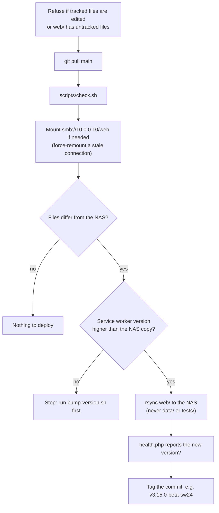

# Deployment

MakerVault runs on a Synology NAS under Web Station: nginx serves the static files and PHP 8 runs the API. The live site is at `/volume1/web/MakerVault` on the NAS, which the Mac sees as `/Volumes/web/MakerVault` over SMB.

The setup follows the same pattern as the earlier Topps Binder project on the same NAS, with one difference: MakerVault keeps its data in SQLite on the server, so every device sees the same data without any sync.

## Requirements on the NAS

1. Web Station
2. Nginx as the back end
3. PHP 8.x with these extensions ticked in the PHP profile (DSM, Web Station, Script Language Settings, PHP, your profile, Extensions):

| Extension | Needed for |
|---|---|
| `pdo_sqlite` | The database. Required. |
| `gd` | Resizing uploaded photos. |
| `exif` | Rotating phone photos the right way up. Optional but recommended. |
| `curl` | Product URL import (`scrape.php`). |

## File layout on the NAS

```
/volume1/web/MakerVault/
├── index.html, sw.js, manifest.json, .user.ini
├── css/  js/  icons/  assets/
├── api/                ← PHP endpoints, _bootstrap.php, schema.sql
└── data/               ← created at runtime, never overwritten by a deploy
    ├── makervault.db   ← the live database (plus -wal and -shm files)
    ├── photos/         ← <item-id>.jpg
    └── attachments/    ← <item-id>/<file>
```

`data/` is the only folder that changes at runtime. Everything else is copied from the Git repository by `scripts/deploy.sh`.

## First-time setup

1. Create the web service: DSM, Web Station, Web Service, Create, PHP (not static, since the API is PHP). Document root `/volume1/web/MakerVault`, back end Nginx, and the PHP 8 profile with the extensions above.
2. Create the portal: Web Portal, Create, port-based on port 8742 (the port the original FastAPI server used), or name-based if you have local DNS.
3. Copy the code. The first time, use the manual rsync below: `deploy.sh` checks for an existing `sw.js` on the NAS to know the share is mounted, so it stops on an empty folder. From then on, use `scripts/deploy.sh`.
4. Check `http://<nas-ip>:8742/api/health.php`. You want `"status": "healthy"` and `"db_writable": true`. The first call creates an empty database.

### Permissions

The API has to write the database, its journal files and the photo and attachment folders. If `db_writable` is false or writes fail with a 500, fix ownership over SSH:

```sh
sudo chown -R bryan:http /volume1/web/MakerVault
sudo find /volume1/web/MakerVault -type d -exec chmod 775 {} \;
sudo find /volume1/web/MakerVault -type f -exec chmod 664 {} \;
```

Folders need group write (775) because SQLite creates `-wal` and `-shm` files next to the database.

### HTTPS

The camera scanner and offline mode only work on a secure origin, so use the HTTPS address from the QuickConnect portal on phones. Plain HTTP on port 8742 works for everything else.

### Upload size

`web/.user.ini` raises PHP's upload limit to 16 MB (20 MB per request) so phone photos and attachments fit. Web Station's PHP-FPM reads it from the site folder. The local `php -S` server ignores it, but the app shrinks photos before uploading anyway.

## Deploying an update

From the Mac:

```sh
cd ~/Developer/MakerVault
git checkout main && git pull
scripts/bump-version.sh 3.15.0-beta   # if web/ changed since the last deploy
git commit -am "Release 3.15.0-beta" && git push
scripts/deploy.sh --dry-run           # optional preview
scripts/deploy.sh
```

`deploy.sh` does this, stopping at the first problem:



Settings can be changed with environment variables: `MV_NAS_SHARE` (default `smb://10.0.0.10/web`), `MV_NAS_PATH` (default `/Volumes/web/MakerVault`), `MV_HEALTH_URL` (default `http://10.0.0.10:8742/api/health.php`). Use `--skip-checks` to skip `check.sh` when you've just run it.

Installed copies of the app pick up the new version on their own (see [subsystems/offline-and-updates.md](subsystems/offline-and-updates.md)).

The manual fallback, if the script can't run:

```sh
rsync -av --exclude '.DS_Store' --exclude 'data/' --exclude 'tests/' web/ /Volumes/web/MakerVault/
```

Never copy `data/` to the NAS. The NAS database is the live one, and overwriting it loses every change made since.

## Locking down `data/`

`data/` sits inside the web root, so anyone on the network who knows the URL can download `makervault.db`, photos and attachments directly. Directory listing is blocked, but direct file links work.

That's acceptable for a home network. Before exposing the portal to the internet, do one of these:

1. DSM, Web Station, Web Portal, your portal, Access Control Profile: deny `/data/*`. The API reads these files from disk, not over HTTP, so nothing breaks.
2. Restrict the portal to your LAN address range.

The app also has no login. See [known-issues.md](known-issues.md#security-and-privacy).

## Backups

| Layer | What it covers |
|---|---|
| Hyper Backup of `/volume1/web/MakerVault` | Everything: database, photos, attachments. This is the real backup. |
| Settings, Download JSON backup | Most tables, as a consistent snapshot. Has gaps on restore, listed in [known-issues.md](known-issues.md#backup-and-restore). |
| Settings, Download CSV | Items only, for spreadsheets. |

SQLite runs in WAL mode. A file-level copy taken in the middle of a write is usually fine, and the JSON export is always consistent, so keep dated JSON backups somewhere Hyper Backup also covers.

## Troubleshooting

| Symptom | Likely cause | Fix |
|---|---|---|
| `api/health.php` shows PHP source code | The web service was created as a static site | Recreate it as PHP |
| `could not find driver` | `pdo_sqlite` is off | Tick it in the PHP profile |
| `"db_writable": false` | Ownership or permissions | Run the chown and chmod commands above |
| Photo upload fails with 500 | `gd` is off | Tick it in the PHP profile |
| Photo upload fails with 413 | File over the upload limit | Check that `.user.ini` was deployed. Shrink the file. |
| Phone photos sideways | `exif` is off | Tick it and upload again |
| "Cannot reach the MakerVault API" | PHP not running for the site, or `data/` not writable | Open `health.php` directly and check permissions |
| Old version after a deploy | The service worker version didn't change, or the client is older than 3.5.2 | Run `bump-version.sh` and deploy again. Old clients need one manual refresh. |
| `rsync` fails with `io_read_flush` | Stale SMB connection | `deploy.sh` remounts once. Otherwise `diskutil unmount force /Volumes/web` and reconnect in Finder (⌘K, `smb://10.0.0.10/web`). |
| `deploy.sh` can't write to the share | macOS privacy settings blocking the terminal | Mount the share from Finder first |

## Migrating from the native app (done 2026-07-07)

The live database was copied from the Mac app with SQLite's backup command, not exported, since the schema is the same:

```sh
sqlite3 ~/Library/Application\ Support/MakerVault/makervault.db \
  ".backup '/Volumes/web/MakerVault/data/makervault.db'"
cp ~/Library/Application\ Support/MakerVault/photos/*.jpg \
  /Volumes/web/MakerVault/data/photos/
```

The native app was retired in 3.14.0 and the NAS database is the only source of truth.
