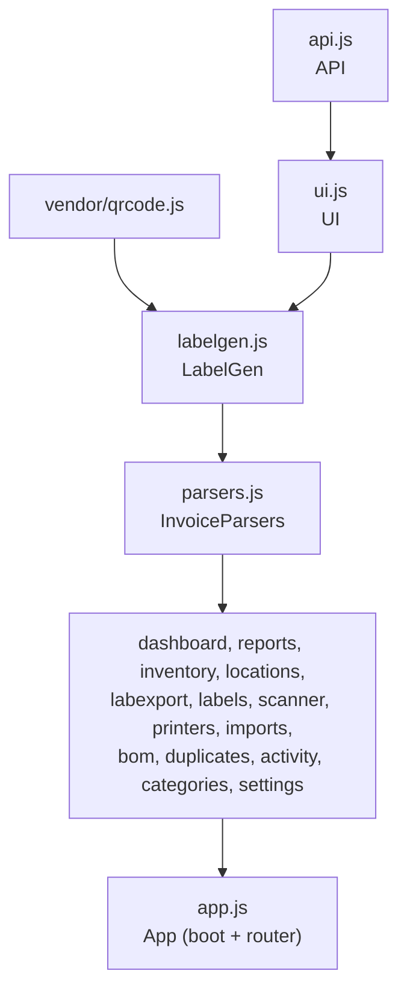

# Frontend modules

All browser code lives in `web/js/`. Every file is a plain script loaded by `web/index.html` (no modules, no bundler). Each one either defines a global helper object or registers a view on `window.Views`.

For how these pieces fit together, read [architecture.md](architecture.md) first.

## Load order and dependencies

`index.html` loads the scripts in this order. A file can use anything loaded above it.

`app.js` loads last because it calls `boot()` on `DOMContentLoaded` and expects every view to be registered by then.

## Shared helpers

### `api.js`: the `API` object

A thin wrapper around `fetch()` with one method per server call (`API.listItems()`, `API.updateItem()`, `API.locationTree()` and so on). It throws an `Error` carrying the server's `detail` message on any non-2xx response, so views can show it in a toast.

It also owns the offline outbox. When an item write (`items.php`, but not batch actions) fails with a network error, the request is saved in `localStorage` under `mv-outbox` instead of failing. `replayOutbox()` sends queued requests in order when the browser comes back online. New items get a UUID on the client so a queued create keeps its identity when replayed. Uploads, imports and restores are never queued.

### `ui.js`: the `UI` object

| Function | What it does |
|---|---|
| `h(tag, attrs?, ...children)` | Builds DOM. `tag` accepts `div.class1.class2`. Null and false children are skipped. `style` takes an object, `on*` keys become listeners. |
| `modal({ title, body, footer, wide, onClose })` | Opens a stacked dialog. Escape closes only the top one, Tab is trapped inside it, and a backdrop click only closes it when the press started on the backdrop. |
| `confirmDialog(title, message, label)` | Promise that resolves `true` or `false`. |
| `toast(message, isError)` | Short message at the bottom of the screen. |
| `swatch(filament)` | Draws a filament color chip for solid, gradient, split, sparkle and silk color modes. |
| `categoryIcon(category)` | Maps the stored SF Symbol name to an emoji (`SF_ICON_MAP`). |
| `relativeTime(ts)`, `money(v)`, `stockBadge(item)`, `debounce(fn, ms)` | Formatting helpers. |
| `closeAllModals()` | Called by the router on every navigation. |

### `app.js`: the `App` object

Boots the app, runs the hash router and keeps two shared caches:

- `App.state.categories` and `categoryByKey`
- `App.state.locationTree` and `locationById`, where each location also gets a `fullPath` such as `Garage Workshop › Closet Rack › Shelf 1`

Views call `App.refreshCategories()` or `App.refreshLocations()` after changing those lists. `App.locationName(id)` and `App.locationPath(id)` read from the cache.

`app.js` also registers the service worker, checks for updates on launch, on return to foreground and hourly, reloads the page once when a new version takes over, and replays the outbox when the connection returns. The sidebar footer shows the version, item count, offline state and the number of queued edits.

### `labelgen.js`: the `LabelGen` object

The label rendering engine. It draws a label template onto a `<canvas>` at any DPI. It is a port of the native app's Python label pipeline.

- It replaces tokens such as `{name}`, `{sku}` and `{location}` with the bound item's or location's values (the full list is in [subsystems/labels.md](subsystems/labels.md#templates)).
- Each line's height is proportional to its font size. Lines can auto-fit, wrap, split into left and right text, and have a background fill.
- It draws filament color circles with the same color modes as `UI.swatch()`, plus marble.
- Code 128 barcodes are drawn as exact rectangles (checked bit for bit against `python-barcode`). QR codes come from the vendored `qrcode.js`.
- There are four layouts: text only, text plus barcode, text plus QR, and all three.

See [subsystems/labels.md](subsystems/labels.md).

### `labexport.js`: the `LabelExport` object

Builds Bambu Suite print-then-cut projects (`.lac` files) from label PNGs, and reads them back. It includes a small ZIP writer and reader, and a shelf-packing layout that fits mixed label sizes onto A4 sheets. See [subsystems/labels.md](subsystems/labels.md#bambu-suite-lac-export).

### `parsers.js`: the `InvoiceParsers` object

Turns the text of a PDF invoice into line items. It handles Bambu Lab digital invoices, Bambu Lab order pages and Amazon order summaries. `classifyProduct(name, variant)` gives each product a category and a cleaned-up name, and is shared with the product-URL importer. See [subsystems/importing.md](subsystems/importing.md).

## Views

Each view is reachable at `#/<name>`. On desktop the sidebar lists every view except Categories and Duplicates, which open from Settings. On phones the bottom bar shows Dashboard, Inventory, Locations, Scan and Settings. Settings links to Labels, Printers, Import, BOM and Activity, and the Dashboard has a Reports button.

| Route | File | What it shows |
|---|---|---|
| `#/dashboard` | `dashboard.js` | Totals, low and out-of-stock counts, inventory value, items per category, loaded filament, recent activity. Tiles link to filtered lists. |
| `#/inventory` | `inventory.js` | The item list, item details, the add/edit form. The largest view (about 1,200 lines). |
| `#/locations` | `locations.js` | The storage tree on the left, the selected location's items on the right. |
| `#/labels` | `labels.js` | Template gallery and the label designer. Also exports the quick-print dialogs used elsewhere. |
| `#/scanner` | `scanner.js` | Camera scanning, manual code entry and audit mode. |
| `#/printers` | `printers.js` | Printers, AMS units and which spool is loaded in each slot. |
| `#/import` | `imports.js` | PDF invoice import and hardware kit import, both through a review table. |
| `#/bom` | `bom.js` | Checks a Makerworld bill of materials against inventory. |
| `#/activity` | `activity.js` | The full change log, with filters, search and paging. `#/activity?item=<id>` shows one item's history. |
| `#/reports` | `reports.js` | Inventory value, 12-month spending chart, value by category and by vendor. |
| `#/settings` | `settings.js` | Backups, CSV export, restore, server health, links to Categories and Duplicate Finder. |
| `#/categories` | `categories.js` | Add, rename, recolor, reorder and delete categories. |
| `#/duplicates` | `duplicates.js` | Groups of likely duplicate items, with merge and "not duplicates". |

### Inventory (`inventory.js`)

The list supports text search (name, brand, SKU, UPC, barcode, description, notes, tags), category, stock status and sort order. Each row has plus and minus buttons for quick quantity changes.

Smart filters sit above the list. Three are built in (Low Stock, Checked Out, No Location). Custom ones are built from conditions over 11 fields (name, brand, vendor, category, tags, notes, quantity, price, filament material, has photo, low stock) and saved in `localStorage` on that device.

Select mode turns rows into checkboxes and shows a bulk bar: edit up to seven fields at once, move to a location, print labels or delete. Batch edits go to `items.php?action=batch` and run in one transaction.

The item detail sheet (`openDetail`) shows the quantity stepper (tap the number to type an exact count, Escape cancels), action buttons (print label, duplicate, jump to location, copy barcode, check out or in for tools, reorder link), all fields including custom fields and pack pricing, attachments and the item's recent history with a link to the full log.

The add/edit form (`itemForm`) has a product URL box at the top that fills empty fields from a store page and attaches the product photo. Filament fields appear when the category is Filament. The barcode field has a button that reserves the next `MV-<PREFIX>-00001` code. The photo field opens the rear camera directly on iPhones (`capture="environment"`).

### Locations (`locations.js`)

The tree remembers which nodes are open (`localStorage`). Selecting a node shows its breadcrumb path, item list and buttons to print a QR label, print QR labels for the location and every sub-location, add a sub-location or add an item there. Deleting a location moves its children up one level unless you choose to delete them too.

### Labels (`labels.js`)

Two modes. The gallery is the landing page: each template renders a live preview with sample data, and templates can be imported and exported as JSON. The designer edits one template with a live preview, line editor, size presets (with a manager for adding and deleting them), item or location binding, PNG export and printing.

`labels.js` also exports three functions other views call:

- `quickPrint({ itemId })` or `quickPrint({ locationId })`: the compact print dialog on the item sheet and location panel
- `quickPrintItemBatch(ids)`: labels for the items picked in select mode, with PNG sheet and `.lac` export
- `printLocationBatch(ids)`: QR labels for a location tree

### Scanner (`scanner.js`)

Uses the browser's `BarcodeDetector` where it exists (Chrome on desktop and Android) and loads ZXing on iPhones and iPads. The camera needs HTTPS. A text box handles typed or pasted codes everywhere. A flashlight button appears when the camera supports torch control.

In audit mode the camera keeps running, and each scan opens a counter for that item so you can adjust its quantity in place. A running list shows everything scanned in the session. See [subsystems/scanning.md](subsystems/scanning.md).

### Printers (`printers.js`)

One card per printer, with a grid per AMS unit (AMS Lite, AMS 2 Pro, AMS HT) plus external spool slots. Tapping a slot loads, swaps or unloads a spool. Loading a spool clears its storage location and remembers it, and unloading sends it back there (or somewhere you choose). Units and slots can be added to an existing printer and deleted.

### Import (`imports.js`) and BOM (`bom.js`)

The Import view takes a PDF by drag and drop, parses it in the browser, and shows an editable review table. Nothing is saved until you press Import. The same view lists CyberBrick hardware kits from `assets/cyberbrick_kits.json`, which go through the same table.

The BOM view reads a Makerworld `.xlsx` bill of materials in the browser, sends the rows to `bom.php` and shows which parts you have, which are short and which are missing.

Both are covered in [subsystems/importing.md](subsystems/importing.md).

### Reports (`reports.js`)

The spending chart is an inline SVG built by hand (no chart library). It uses CSS variables, so it follows the light or dark theme. Category and vendor breakdowns are HTML bar rows. Text labels carry the meaning and bar color is decoration only.

### Settings, Categories, Duplicates, Activity

`settings.js` downloads the JSON backup and the items CSV, restores from a backup file (after two confirmations), and shows the server health check. `categories.js` manages the category list. Built-in categories can't be deleted, and deleting a custom one moves its items to Other. `duplicates.js` lists groups from `duplicates.php` with a confidence badge, lets you pick the item to keep and merges the rest into it, adding quantities. `activity.js` pages through the log 50 entries at a time.

## Styling

`web/css/app.css` holds all styles. The default theme is dark, and a light theme applies through `prefers-color-scheme: light`. Above 760 px wide the layout has a sidebar, and below that it has a bottom tab bar. Touch targets get bigger on coarse pointers, and iOS safe-area insets are respected when the app is installed to the home screen.
