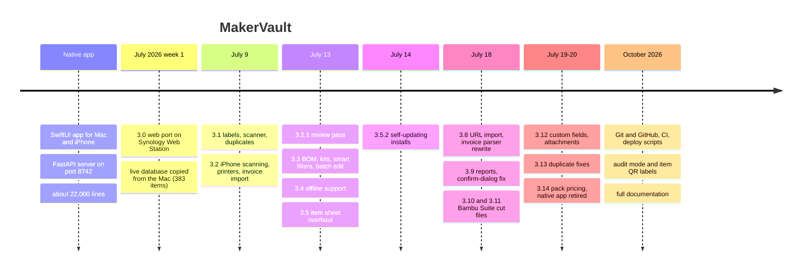

# Project history

How MakerVault got to where it is, and what the bigger bugs taught along the way. For the version-by-version list, see [CHANGELOG.md](../CHANGELOG.md).

## Timeline

## Why a web app

The original MakerVault was a native SwiftUI app with a Python server. It worked well, but it only ran while the Mac was awake, and every change meant an Xcode build. Bryan already ran a web app on the NAS (the Topps Binder project) with static files and a small PHP API, and that pattern needed no installs on any device.

The port kept the database schema exactly as it was, so the live data moved over by copying one file. The difference from the binder project is where the data lives. The binder stores data in each browser and syncs it through PHP. MakerVault keeps one SQLite database on the NAS, so there is nothing to sync.

## How the work was done

Most of MakerVault was built in a series of long sessions with Claude Code on the Mac, roughly one phase per session, each ending with a written handoff in the project notes. Between sessions, Bryan tested each release on a phone and reported what broke. The project had no version control until October 2026, so the handoff notes and the archived tarball of the native app were the only history. Those notes are preserved in [archive/project-notes-2026-07.md](archive/project-notes-2026-07.md).

## Bugs worth remembering

Each entry says what went wrong, why, and what changed afterwards.

### The confirm dialog that always said no

Version 3.9.0. For a while every confirmation in the app did nothing: deleting an item, a location, a template, a printer or a category, merging duplicates and restoring a backup. The dialog appeared, you pressed Delete, it closed, and nothing happened.

`UI.confirmDialog()` closed the modal before resolving its promise with `true`. Closing a modal calls its `onClose` handler, and the handler resolved the same promise with `false`. A promise only settles once, so the first call (`false`) won and the `true` was ignored.

The fix was to resolve first and close second. When a close handler and an action both settle the same promise, the order of those two lines decides the result. The API smoke test can't catch this kind of bug, because it lives in the browser, which is one reason a browser-level test is on the [roadmap](../ROADMAP.md).

### Deploys that never arrived

Version 3.5.2. New code reached the NAS, but phones kept showing the old version for days. Three things combined. The service worker only checked for updates when a page was loaded from scratch. The "new version" toast had a race and sometimes never showed. And an app installed to the iOS home screen resumes from memory instead of reloading, so it might not do a fresh load for days.

The app now checks for a new worker on launch, whenever it comes back to the foreground, and every hour, and reloads itself once when the new worker takes over. All three come down to one fact: the worker's version number is the only signal installed copies get. If it doesn't change, nothing updates. That led to `scripts/bump-version.sh` and the guard in `scripts/deploy.sh` that refuses to ship without a bump.

### Inventory value five times too high

Version 3.14.0. The dashboard's inventory value was far too high. Items stored the price of the pack they were bought in, but the quantity in pieces. A $11.49 bag of 2,000 cork pads was valued at $11.49 × 2,000 = $22,980.

The native app's report code had the same formula, and for months the web port kept it on purpose so both apps would agree. Retiring the native app removed that reason. The fix added `pack_quantity` (how many units one price covers), divided by it everywhere value is computed, and backfilled 27 items, removing $40,995 that didn't exist. `purchase_price` still means exactly what the receipt says.

### The invoice parser that lost one item per invoice

Version 3.8.0. Every Bambu Lab invoice import came in one item short, and some long product names were cut off. The parser read PDF text cells in order and assumed each item's numbers followed its `SKU:` cell. In the PDF, some items have their quantity and price row placed above the SKU cell, so those rows were attached to the wrong item or dropped.

The rewrite stopped trusting text order. It reads each piece's position and font from pdf.js. Product names are bold, so each bold piece starts a new item, and the numeric columns are identified by their horizontal position under the header. Each invoice is also checked against its own subtotal, so a parse that doesn't add up is flagged before import. A test harness now runs the real parser against real invoices.

### Screws filed under a category that didn't exist

Version 3.9.0. Imported screws showed an arbitrary category in the review table. The parser emitted `screw`, the native server's internal name, while the category table's key is `screws`. Every import since the port had been affected. A one-line migration in `_bootstrap.php` moved existing items, and the parsers now emit real category keys and fall back to `other` for anything unknown.

### Different colors of filament flagged as duplicates

Version 3.13.0. The duplicate finder grouped spools like "PLA Basic, Red" and "PLA Basic, Blue". The matching ran on raw item rows, which don't include the filament table where color lives, so it saw two items with the same name. Filament is now only a duplicate on the same SKU, or the same name, color and spool type. On the real data, filament groups dropped to the two genuine duplicates.

### A location inside itself

Version 3.2.1. A location could be moved under one of its own sub-locations. The tree then had a loop, and deleting the location recursively never finished. `locations.php` now walks up from the new parent before saving and refuses a move that would create a loop.

### iPhones without a barcode reader

Version 3.2.0. The scanner was built on the browser's `BarcodeDetector`, which doesn't exist in any iOS browser (they all use WebKit). The scanner now loads ZXing, a JavaScript decoder, only on devices that need it, and decodes scaled-down camera frames through a canvas.

### Barcodes that wouldn't scan

Native app. Labels printed by the old app sometimes produced barcodes scanners couldn't read. The bars were drawn small and then enlarged with a smoothing filter, which blurred their edges. The web label engine draws every bar as an exact rectangle at the final resolution and never resizes the result, and its Code 128 output was checked bit for bit against the Python library the native app used.

### Photos downloaded on every refresh

Version 3.2.1. Photo URLs had the current time appended to bust caches, so every list refresh downloaded every photo again. URLs now carry the item's `updated_at`, and `photo.php` tells browsers they can keep the photo for a week. A new photo means a new `updated_at`, so changes still show.

### An app narrower than the phone

Version 3.9.0. On iPhones the whole app rendered about 15% narrower than the screen. A `margin-inline: auto` meant for very wide screens also applied to the flex layout on phones and absorbed the free space. In the same release, tall item sheets on phones let the list show through below them because the dialog was stretched to the viewport height instead of its content. Both were CSS fixes, and phone-size checks became part of testing.

## Patterns that came out of this

- Check numbers against something independent. The invoice subtotal check and the parser harness both exist because the parser looked right and wasn't.
- Make silent failures loud. Several of the worst bugs (confirm dialogs, stale deploys) produced no error at all.
- Keep one formula for each number. Stock value is computed with the same expression in every place it appears.
- Keep a backup before changing live data. The name cleanup and the value backfill both ran against a fresh backup.
