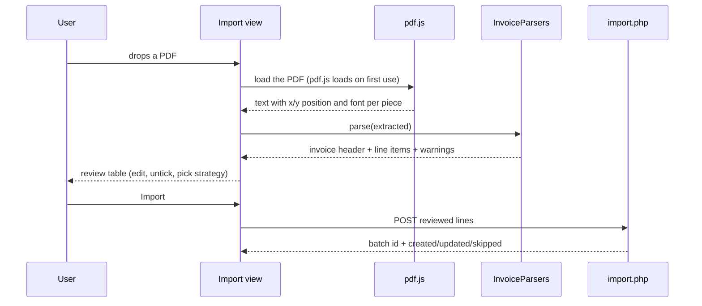
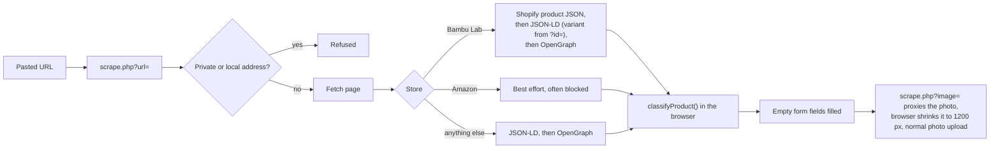
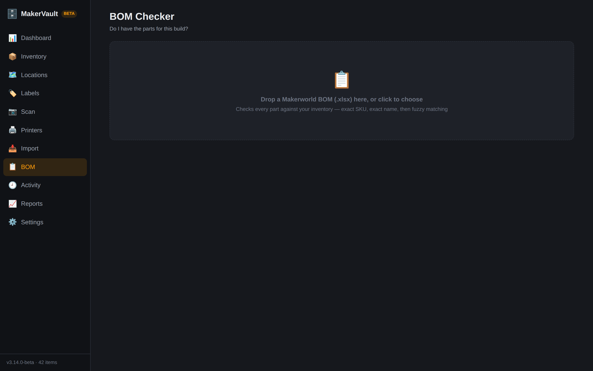

# Importing

There are four ways to bring things into MakerVault without typing every field:

| Source | Screen | Parsed in | Saved by |
|---|---|---|---|
| PDF invoices (Bambu Lab, Amazon) | Import | Browser (pdf.js + `parsers.js`) | `import.php` |
| CyberBrick hardware kits | Import | Browser (`assets/cyberbrick_kits.json`) | `import.php` |
| A product page URL | Add/Edit item form | Server (`scrape.php`) | Normal item save |
| Makerworld bill of materials | BOM | Browser (SheetJS) | Nothing saved: read-only check against `bom.php` |


## Invoice import



Nothing is written to the database until the Import button in the review table is pressed.

### Extraction

`InvoiceParsers.extractFromPdf(pdf)` reads every page with pdf.js and returns three views of the same text:

- `lines`: text joined into rows (pieces within 3 points of each other vertically count as one row), used by the Amazon and order-page parsers
- `cells`: the individual text pieces in reading order
- `pages`: every piece with its `x`, `y` and font name, used by the Bambu invoice parser

### Bambu Lab invoices

`parse()` picks the parser from the text: anything mentioning Amazon (or an Amazon-style order number) goes to `parseAmazon`, everything else to `parseBambu`.

Bambu Lab produces three layouts, and `parseBambu` handles each:

| Layout | How it is recognized | Parser |
|---|---|---|
| Digital invoice (the PDF from the order email) | `SKU:` cells | `parseBambuDigitalXY`, with `parseBambuDigital` as fallback |
| Web order page saved as PDF | `Order No:` and `$price` lines | `parseBambuOrderPage` |
| Printed table | neither | generic fallback |

The digital invoice parser works from positions and fonts, not from the order of the text. Product names are set in Times-Bold, so every bold piece starts a new line item. Amount columns (list price, quantity, discount, subtotal, tax) are told apart by their x position under the header row. This design came from real failures of the earlier parser, which read cells in order:

- The quantity and price row of some items sits above the item's `SKU:` cell in the PDF, so the old parser lost one item per invoice (B-XC011 on one order, B-XC003 on another).
- Long product names wrap onto two lines, and the old parser cut them short or let the second line spill into the next item.
- A total could attach to the wrong neighbour.

If fonts are missing from the PDF, the old cell-order parser still runs as a fallback.

Each invoice is checked against its own "Items Subtotal". When the parsed lines don't add up to it, the review table shows a warning so you know to look closer before importing.

### Product names and categories

`classifyProduct(name, variant)` turns store names into the naming style used across the inventory and picks a category key that exists in the database:

| Store name and variant | Becomes |
|---|---|
| Screw product, variant `M3x8 (pack of 100)` | `M3x8 BHCS Machine Screw`, description `Pack of 100` |
| Variant that is the fuller name, such as a motor's rpm | `N20 Reduction Gear Motor 400rpm` |
| Size-only variant on bearings | `Steel Deep Groove Ball Bearings 6704ZZ` |
| Filament, variant `Jade White (10100)` | Material, color, hex color and spool type filled in |
| Printer compatibility lists | Moved into the description |

The same function runs for product URL imports, so both paths produce the same names. If a parser emits a category key the database doesn't have, the review table and `import.php` both fall back to `other`. (In 3.9.0 a mismatch between `screw` and `screws` had to be repaired with a migration. See [history.md](../history.md).)

### Review table and duplicate handling

Every parsed line appears with editable name, category, quantity, unit and price, and a checkbox to leave it out. Before importing, choose what happens to lines that match an existing item:

| Choice | `duplicate_strategy` | Effect |
|---|---|---|
| Always create new items | `create` | A new item for every line. |
| Add quantity to existing duplicates | `update` | Adds the quantity, updates price, date and vendor, fills blank SKU, subcategory and description. |
| Skip duplicates | `skip` | Leaves matching items alone. |

Matching uses the SKU first, because names repeat (there are eight filaments called "ABS"). Without a SKU it falls back to name, brand and category.

The price saved on the item is the price actually paid per unit after discounts. The whole invoice line (list price, discount, tax, line total, quantity) is kept in `import_batch_items` for reference. "Pack of N" in a line sets the item's `pack_quantity`, so stock value stays correct.

### Testing the parsers

`web/tests/parsers-harness.node.js` runs the real pdf.js and `parsers.js` in Node against sample invoices in `web/data/samples/` and checks item counts, spot values and that totals match. The samples are Bryan's real invoices, so they are not in git. Without them the harness skips those cases and still passes. Run it after any change to `parsers.js`:

```sh
node web/tests/parsers-harness.node.js
```

## Hardware kits

`web/assets/cyberbrick_kits.json` lists CyberBrick kits and their parts. Picking a kit on the Import screen fills the same review table, with the strategy set to "add quantity to existing" because kits usually top up parts you already have.

## Product URL import

The add/edit item form has a URL box at the top. Paste a product page and the form fills in any empty fields: name, brand, vendor, SKU, price, description and reorder link. The product photo is attached too.



The scraper is the only part of MakerVault that makes outgoing requests. It resolves the host (IPv4) first and refuses private, loopback and reserved addresses. It then follows up to five redirects without checking them again, so a public page that redirects to a home-network address would get through. This is listed in [known-issues.md](../known-issues.md#security-and-privacy).

Bambu filament pages don't expose a part-number SKU, only internal variant numbers, so a URL import of filament leaves the SKU blank.

## BOM checker



Makerworld and CyberBrick projects publish a parts list as an `.xlsx` file. Drop it on the BOM screen and the browser reads it with SheetJS (loaded on first use), then sends the rows to `bom.php`.

Each part is matched three ways, in order:

1. Exact SKU
2. Exact name, also checking the name an item had on its original invoice
3. Fuzzy name match at 85% similarity or better (PHP `similar_text`), which catches one-letter typos

The result shows a readiness meter, filter chips for in stock, partial, out of stock and not found, and a button to add a missing part as a new item.
