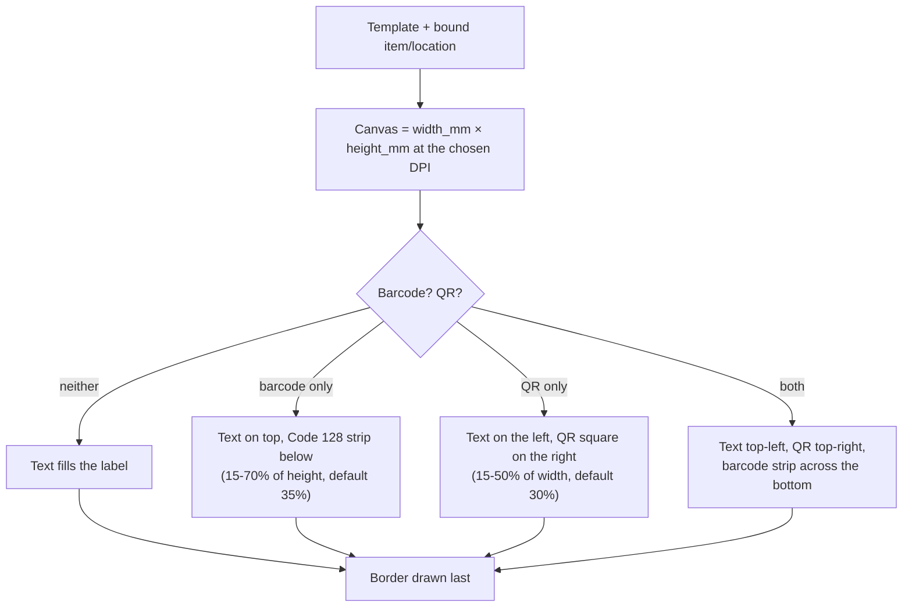

# Labels

MakerVault designs and prints labels for items and storage locations. Rendering happens entirely in the browser on a `<canvas>`, so the same code makes the on-screen preview, the PNG download, the print job and the Bambu Suite cut project.


## Files

| File | Role |
|---|---|
| `web/js/labelgen.js` | `LabelGen.render()`: draws one label. Token substitution, text layout, color circles, Code 128, QR. |
| `web/js/labels.js` | The Labels view (gallery and designer) and the print dialogs other screens open. |
| `web/js/labexport.js` | `LabelExport`: ZIP writer and reader, sheet packing, `.lac` build and read. |
| `web/api/labels.php` | Stores templates and presets, and returns the data that fills in tokens. |
| `web/assets/starter_templates.json` | Eight ready-made templates added by the Starter Pack button. |
| `web/assets/lac/` | Bambu Suite machine, material and process configs copied into every `.lac`. |

## Templates

A template is a size, a few style options and a list of text lines:

```json
{
  "name": "Storage Box (60×30)",
  "width_mm": 60, "height_mm": 30, "padding_mm": 1.2,
  "background_color": "#FFFFFF", "border_enabled": true,
  "border_thickness": 0.5, "border_color": "#000000", "auto_fit": true,
  "lines": [
    {"text": "{name}", "font_family": "Inter", "font_size": 18, "font_weight": "bold",
     "font_color": "#FFFFFF", "alignment": "center", "background_color": "#000000"},
    {"text": "{location}", "font_size": 9, "alignment": "center", "wrap": true}
  ]
}
```

Each line can wrap, can have a background fill, and can be split into a left part (`text`) and a right part (`split_text`). Tokens in braces are replaced with the bound item's or location's values: `{name}`, `{sku}`, `{barcode}`, `{brand}`, `{vendor}`, `{color}`, `{color_hex}`, `{quantity}`, `{unit}`, `{category}`, `{description}`, `{location}`, `{location_type}`. A line containing `{color}` also gets a filament color circle.

Templates are stored in `label_templates` with the lines as JSON in `lines_config`. The gallery's Import and Export All buttons read and write the same JSON format the original FastAPI server used.

## How a label is drawn

`LabelGen.render(opts)` takes a template, an optional item and location, barcode and QR options, and a DPI (150 for previews, 300 for exports). It returns a canvas.



Text lines share the text area in proportion to their font sizes. With auto-fit on, a line that doesn't fit shrinks until it does.

The barcode value is the item's `barcode`, or its SKU, or its UPC. Code 128 bars are drawn as whole-pixel rectangles with no image scaling. That matters: the native app once produced barcodes that wouldn't scan because a resize filter blurred the bar edges.

The QR value is the bound location's `qr_code_value` (for example `makervault://location/<id>`), or `makervault://item/<id>` when printing item QR labels. The scanner understands both.

## Ways to print

| Where | What it does |
|---|---|
| Designer | Edit one template with a live preview, bind any item or location, export a 300 DPI PNG or print. |
| Designer, Batch Print | Pick several items and print one label each. |
| Item sheet, Label button | `quickPrint({itemId})`: choose a template (the last one used is remembered), barcode and QR on or off, number of copies. |
| Location panel, QR label | `quickPrint({locationId})`, the same dialog for a location. |
| Location panel, QR labels × N | `printLocationBatch(ids)`: one QR label for the location and each location under it. |
| Inventory, Select mode, Labels | `quickPrintItemBatch(ids)`: labels for every selected item, as a print job, one PNG sheet, separate PNGs, or a `.lac` project. |
| Labels gallery, PNG drop zone | Drop label PNGs (or old `.lac` files) to print them at exact size, combine them into a sheet, or build a new `.lac`. |

Printing opens a new window with each label as an image sized in millimetres (5 mm page margin, 3 mm between labels), so the browser's print dialog prints them at real size. Turn off "fit to page" scaling in the print dialog.

## Bambu Suite `.lac` export

Bryan cuts labels on a Bambu Lab H2S with print-then-cut on A4 vinyl sticker paper. Bambu Suite saves those jobs as `.lac` files, and MakerVault can write them directly.

A `.lac` file is a ZIP in the OPC style used by 3MF:

| Path in the ZIP | Contents |
|---|---|
| `2D/2dmodel.json` | Canvas objects in millimetres: one raster image and one sticker group with a rectangular cut path per label, inside an attached group per sheet. |
| `2D/Objects/*.png` | The label images. |
| `2D/design_thumbnail.png` | Preview shown in Bambu Suite. |
| `Metadata2D/project_settings.json` | Material batch, and `KCPrintThenCut` for every object. |
| `*.config` | Machine, material and process configs, copied from `web/assets/lac/`. |

The format was worked out from Bryan's own Bambu Suite 01.03 projects. Files made by MakerVault were opened in Bambu Suite to confirm they load ready to cut, with Plane Machining, Vinyl Sticker Paper A4 and 0.24 mm settings.

Labels are placed by `LabelExport.packLabels()`, a shelf packer. Labels are sorted by height, rows are filled left to right inside a 244 × 167 mm usable area, and a row is as tall as its tallest label. When a sheet is full, packing continues on a new sheet, and each sheet becomes its own plate in Bambu Suite. A real export of 48 mixed-size labels (30, 48 and 72 mm wide) fits on one sheet.

`LabelExport.readLac()` reads a `.lac` back and returns each label's PNG and exact size. This lets old hand-built projects be reprinted or rebuilt.

If the cutter or material changes, replace the four files in `web/assets/lac/` with configs exported from Bambu Suite and keep the file names listed in `CONFIG_FILES` in `labexport.js` in sync.

## Size presets

Presets live in `label_presets`. A fresh install gets four (25×10, 40×20, 60×30 and 50×25 mm). The gear button next to the preset menu in the designer opens a manager for adding and deleting presets.
