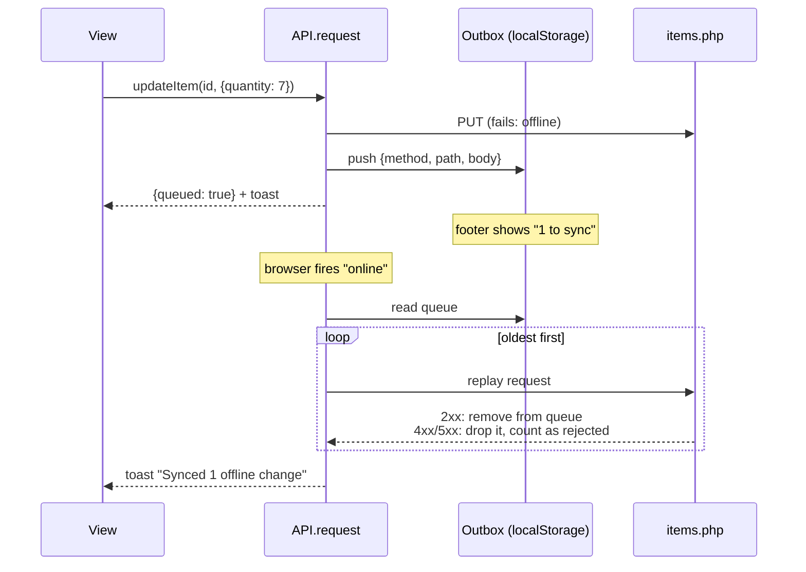
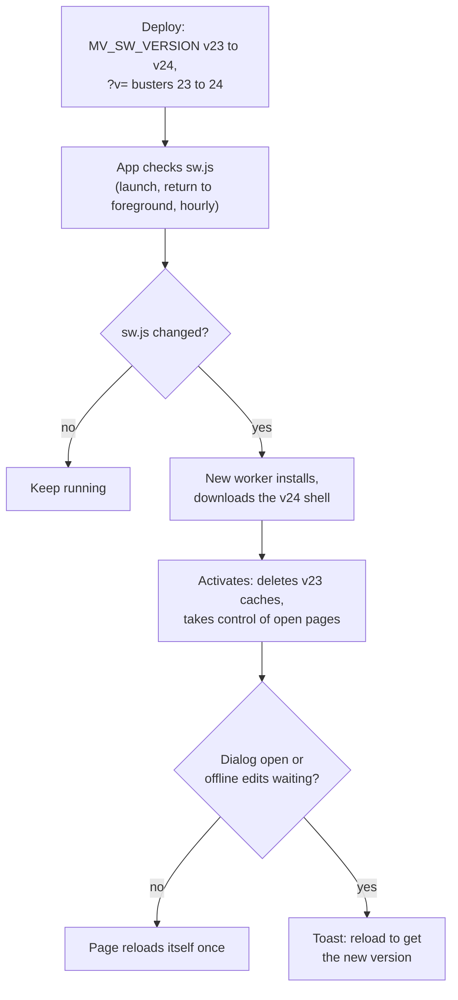

# Offline use and updates

MakerVault can be installed to a phone's home screen and keeps working when the phone loses Wi-Fi: every screen shows the last data it loaded, and item edits are queued until the connection returns. Two pieces make that work, the service worker (`web/sw.js`) and the outbox in `web/js/api.js`.

The same service worker decides when installed copies pick up a new release, which is why every deploy has to change its version number.

## Requirements

Service workers only run on secure origins. On the NAS that means the HTTPS QuickConnect portal. Over plain `http://<nas-ip>:8742` the app works, but without offline support (and without the camera scanner).

## What the service worker caches

There are two caches, both named after the release: `mv-shell-v<N>` and `mv-data-v<N>`, where `N` is `MV_SW_VERSION` in `sw.js`.

| Request | Strategy | Cache |
|---|---|---|
| App shell: `index.html`, `manifest.json`, `css/app.css?v=N`, every `js/*.js?v=N`, icons, `assets/cyberbrick_kits.json` | Downloaded when the worker installs, then always served from cache | shell |
| pdf.js, ZXing, SheetJS | Cached the first time they load | shell |
| `api/photo.php` | Cache first. The URL includes the item's `updated_at`, so a changed photo has a new URL. | data |
| Every other `api/*.php` GET | Network first. On failure, the last cached copy. With no copy, a 503 with a clear message. | data |
| POST, PUT, DELETE | Never touched by the worker | none |

Both caches are deleted when a new version activates. After a deploy, photos and data are fetched fresh the next time they're viewed online.

## Offline edits (the outbox)

`API.request()` in `js/api.js` handles writes. If a write to `items.php` fails because the network is down (not because the server said no), the request is stored in `localStorage` under `mv-outbox`, a toast says the change was saved locally, and the call returns `{queued: true}` instead of the server's reply.

Rules worth knowing:

- Only single-item writes to `items.php` are queued. Batch edits, photos, attachments, imports, restores and printer changes need a connection.
- A new item gets its UUID in the browser, so a create made offline keeps the same ID when it reaches the server.
- Replay happens on the `online` event and at startup, in the original order.
- If the server rejects a queued request (the item was deleted on another device meanwhile, for example), that request is dropped rather than retried forever, and the toast says how many were rejected.
- There is no conflict detection. The last write to reach the server wins.

## How updates reach installed copies

Three things must change together on every release, and `scripts/bump-version.sh` changes all of them:

1. `MV_SW_VERSION` in `web/sw.js`. A byte-identical `sw.js` means the browser sees no update at all.
2. The `?v=N` cache busters on every script and the stylesheet in `web/index.html`. The new worker precaches files by these exact URLs.
3. `MV_VERSION` in `web/api/_bootstrap.php`, which the footer and `health.php` show.

`scripts/check.sh` fails if the numbers in 1 and 2 disagree, and `scripts/deploy.sh` refuses to copy changed files to the NAS under an unchanged worker version.

### Why the app checks for updates itself

Before 3.5.2, deploys reached the NAS but phones kept running the old version for days. The browser only checked for a new worker when the page was loaded from scratch, and an installed iOS app resumes from memory instead of reloading. Now `app.js` calls `registration.update()` on launch, whenever the app comes back to the foreground, and every hour, and reloads once when a new worker takes over.

Clients still on a version older than 3.5.2 need one manual refresh: in a browser, a hard reload; for the installed iOS app, swipe it away in the app switcher and reopen it twice.

## Testing changes without fighting the cache

When working on the frontend locally, the service worker can serve old files even after editing them. Any of these avoids that:

- Bump the version (`scripts/bump-version.sh`), which is what a deploy does anyway.
- In the browser's developer tools, Application, Service Workers, tick "Update on reload" or unregister the worker.
- Open the local server in a private window, which starts with no worker and no caches.
