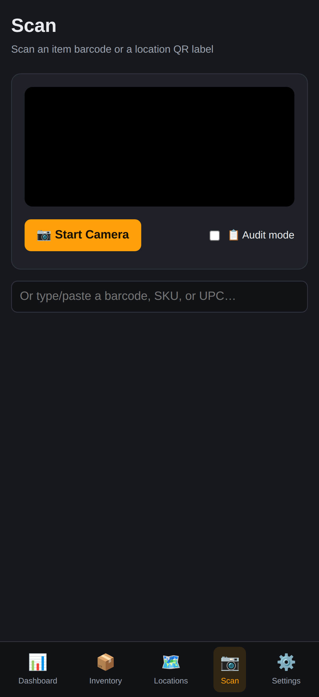
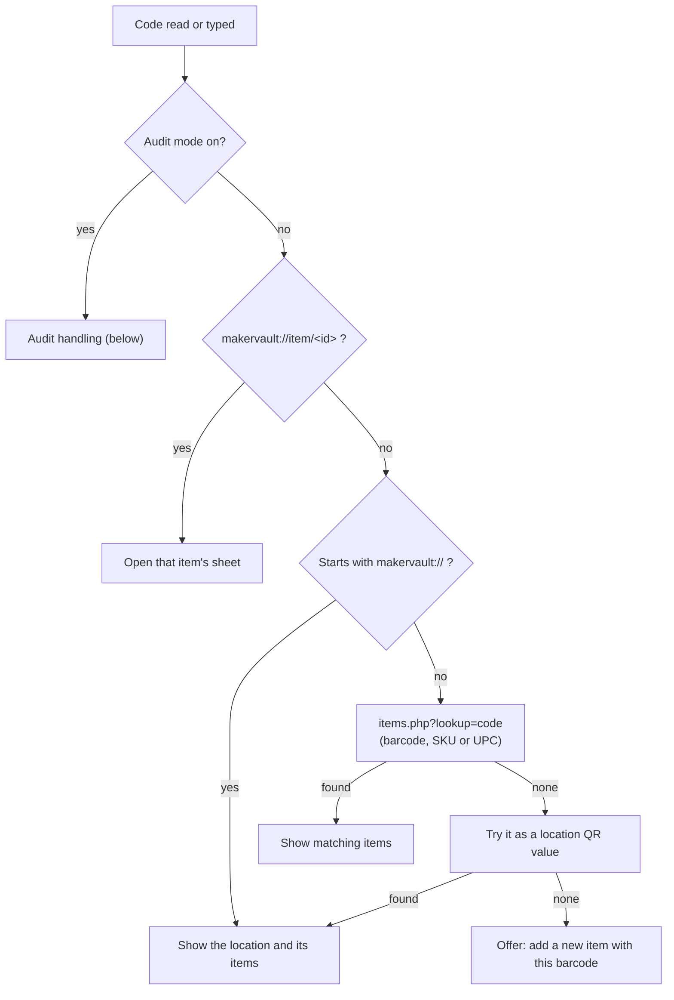

# Scanning

The Scan screen reads barcodes and QR codes with the phone or laptop camera, or from a typed or pasted code. A scan opens the matching item or location. In audit mode it adjusts stock instead.

All of this lives in `web/js/scanner.js`. Lookups go to `items.php?lookup=` and `locations.php?qr=`.

## Two detection engines

| Engine | Where it runs | Notes |
|---|---|---|
| `BarcodeDetector` (built into the browser) | Chrome and Edge on desktop and Android | Fast. The page checks every 120 ms. |
| ZXing-JS (`js/vendor/zxing.min.js`, 336 KB) | iPhone and iPad (every browser there uses WebKit, which has no `BarcodeDetector`) | Loaded only when needed. Video frames are scaled down onto a canvas and decoded every 280 ms. |

Both look for QR, Code 128, EAN-13, EAN-8, UPC-A, UPC-E and Code 39.

The camera only works on HTTPS (or `localhost`). On plain HTTP the Start Camera button can't get a camera, but typing a code still works. The rear camera is used when there is one. A flashlight button appears when the camera reports torch support, which in practice means Android Chrome.

The same code read twice within 2.5 seconds counts once, so holding the camera still over a label doesn't fire repeatedly.

## What a code resolves to

### Code formats MakerVault prints

| Label type | Encodes | Example |
|---|---|---|
| Item barcode (Code 128) | The item's `barcode`, or its SKU, or its UPC | `MV-SCR-00042`, `B-XC011` |
| Item QR | `makervault://item/<item id>` | `makervault://item/3c25572b-...` |
| Location QR | The location's `qr_code_value` | `makervault://location/a0de5f74-...` |

New barcodes come from the barcode button on the item form (`items.php?action=barcode`). They look like `MV-<PREFIX>-<5 digits>`, with one prefix per category (`FIL`, `SCR`, `HDW`, `MOT`, `ELC`, `TUL`, `PPR`, `ADH`, `PAC`, `CRF`, `OTH`, or the first three letters of a custom category).

## Audit mode

Audit mode is for counting stock shelf by shelf. Turn it on with the checkbox next to Start Camera. The setting is remembered on that device.

With audit mode on:

- The camera keeps running after each read.
- Each scanned item appears in a panel with minus and plus buttons. Every press saves the new quantity right away.
- A list underneath shows every item scanned in this session and how many times.
- Scanning a location QR shows a short message with the location name and item count, without leaving the panel.
- If a code matches more than one item, you're asked to switch audit mode off and pick the item normally.

The session list is kept in memory only. Leaving the Scan screen clears it. The quantity changes themselves are saved immediately and appear in the activity log like any other edit.
