# User guide

A tour of every screen, and how to do the everyday jobs. The screenshots use demo data.

On a computer the screens are listed in the sidebar. On a phone the bottom bar has Dashboard, Inventory, Locations, Scan and Settings; Settings links to Labels, Printers, Import, BOM and Activity, and the Dashboard has a Reports button.

## Install it on a phone

Open the HTTPS address of the NAS in Safari (iPhone) or Chrome (Android), then use Share, Add to Home Screen (iPhone) or the install prompt (Android). The installed app opens full screen, works without Wi-Fi using the last data it saw, and updates itself after each deploy.

## Dashboard

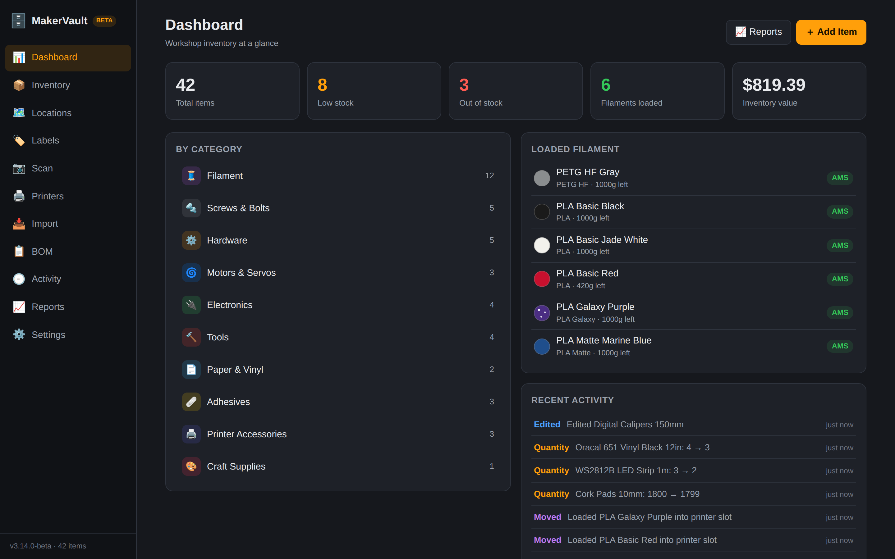

Totals across the top: items, low stock, out of stock, filament loaded in printers and the value of everything on hand. Tap a tile to jump to the matching list. Below are item counts per category, the spools currently loaded and the latest changes.

## Inventory

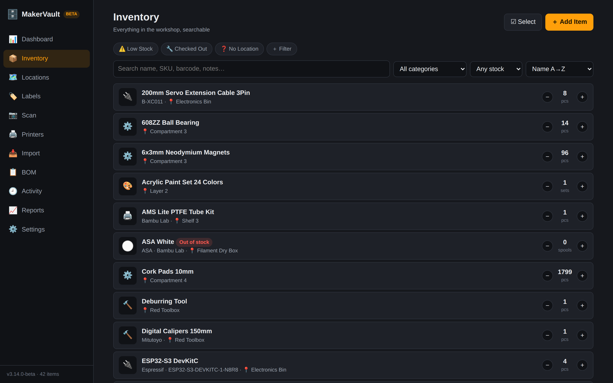

The search box looks through names, brands, SKUs, UPCs, barcodes, descriptions, notes and tags. The menus narrow by category and stock level and change the sort order. Plus and minus on each row change the quantity by one.

The chips above the list are smart filters. Low Stock, Checked Out and No Location are built in. Use + Filter to save your own, for example "Vendor contains McMaster and Price > 10". Saved filters live on the device they were made on.

Filtering by the Filament category shows each spool's color swatch, material and brand:

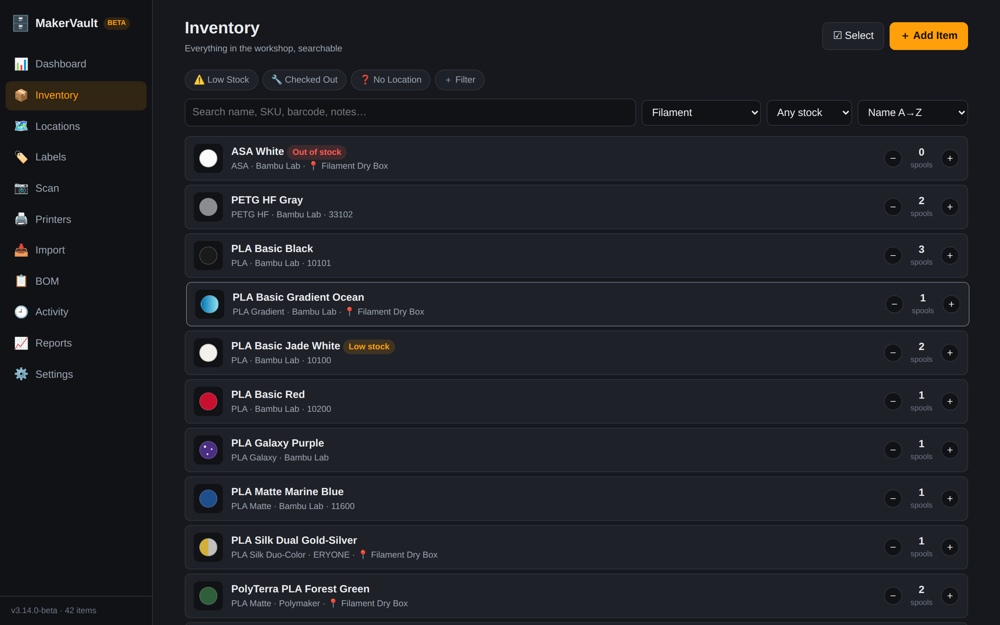

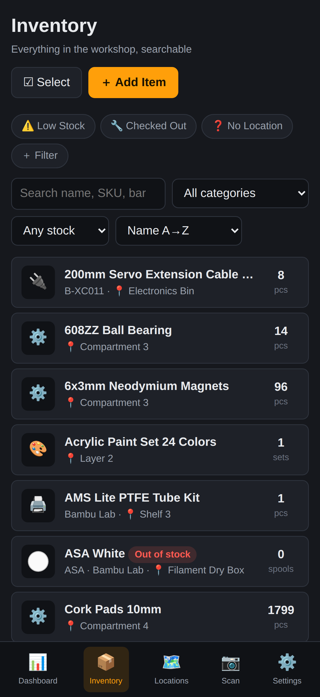

### Item details

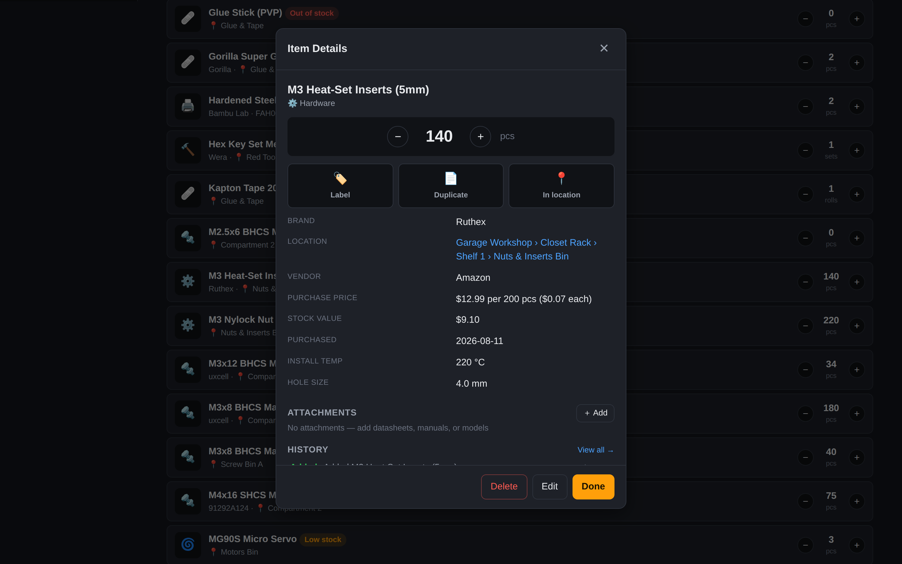

Tap an item to open its sheet:

- The big number is the quantity. Tap it to type an exact count (Enter saves, Escape cancels).
- Label prints a label for this item. Duplicate starts a new item with the same details. In location jumps to where it's stored.
- Tools also get Check out and Check in. Items with a reorder link get Reorder.
- The price line shows what you paid and what one unit costs, for example "$12.99 per 200 pcs ($0.07 each)", and Stock value multiplies that by the quantity.
- Custom fields show in the same list as the built-in ones.
- Attachments holds datasheets, manuals and model files (PDF, images, STL, 3MF, STEP, G-code and more).
- History lists recent changes to the item. View all opens the full log for it.

### Adding and editing

Add Item opens the form. A few parts of it save time:

| Field | What it does |
|---|---|
| Product URL (top of the form) | Paste a Bambu Lab, Amazon or other store link and the empty fields fill themselves, photo included. |
| Price covers (pack size) | If the price was for a bag of 200 screws and you count single screws, enter 200 so the value isn't 200 times too high. |
| Barcode button | Creates the next code for the category, in the `MV-SCR-00001` style. |
| Photo | On a phone, opens the camera directly. |
| Filament section | Appears for the Filament category: material, color, color style (solid, gradient, split, sparkle, silk), weight and status. |
| Custom fields | Any label and value pairs you like. |

### Changing many items at once

Select turns on checkboxes. Pick items, then use the bar at the bottom to edit fields together (category, location, brand, vendor, subcategory, minimum quantity, tags), move them, print labels for all of them or delete them.

## Locations

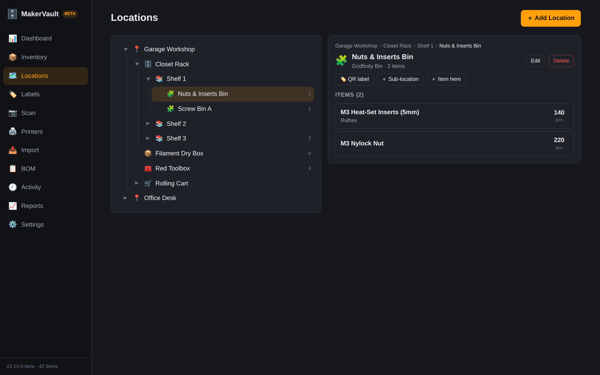

The tree on the left mirrors how things are stored: a rack holds shelves, a shelf holds bins. Select any location to see what's in it, and to:

- print a QR label for it, or QR labels for it and everything under it
- add a sub-location or an item stored there
- edit or delete it (its sub-locations move up a level unless you choose to delete them too)

## Scan

The Scan screen reads item barcodes and location QR labels. Scanning a location shows everything stored there. Scanning an item barcode lists the matching item (tap it to open), and an item QR label opens the item straight away. An unknown code offers to create an item with that barcode. You can also type or paste a code.

Turn on Audit mode to count stock: the camera stays on, and each scan brings up that item with plus and minus buttons that save immediately. See [subsystems/scanning.md](subsystems/scanning.md).

The camera needs the HTTPS address.

## Labels

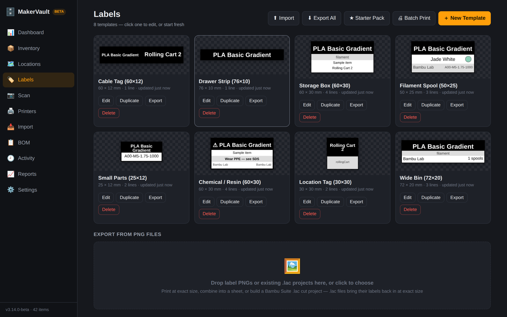

The gallery shows every template with a live preview. Starter Pack adds eight ready-made templates (cable tag, drawer strip, storage box, filament spool and others). Click a template to open the designer.

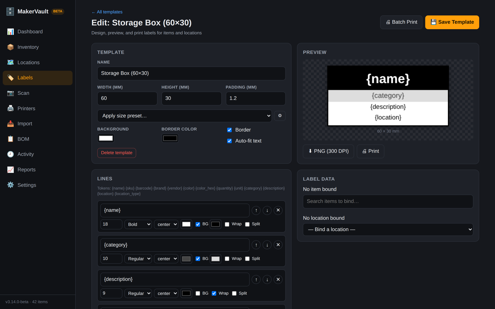

In the designer, each line of text can use tokens such as `{name}`, `{sku}` or `{location}`, which are replaced with the bound item's or location's details. Bind an item on the right to preview real data. Export a 300 DPI PNG or print at exact size.

For cutting labels on a Bambu Lab cutter, select items in Inventory, choose Labels, and export a `.lac` file that opens in Bambu Suite ready to print and cut. Details in [subsystems/labels.md](subsystems/labels.md).

## Printers

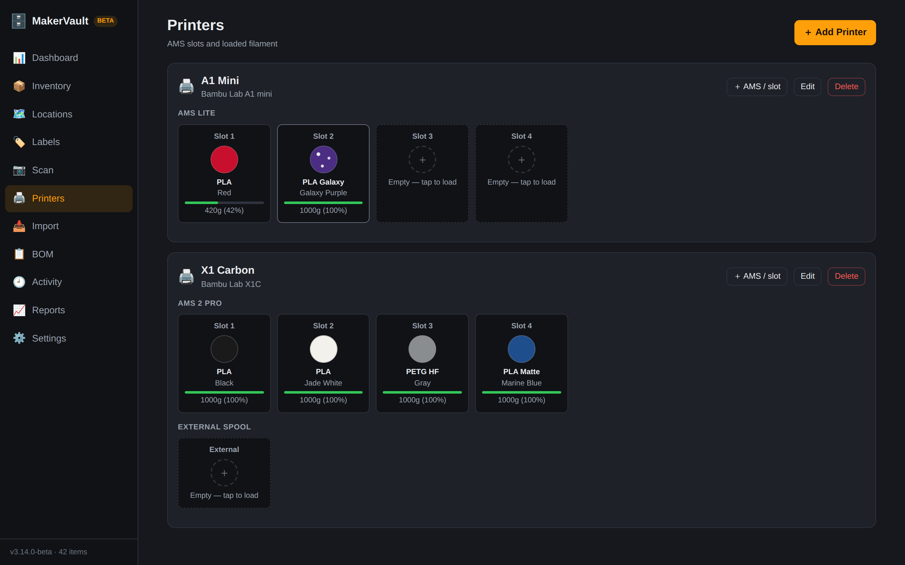

Each printer shows its AMS units and external spool holder. Tap an empty slot to load a spool from inventory, or a full one to swap or unload it. A loaded spool leaves its shelf location while it's in the printer, and unloading puts it back where it came from. Use + AMS / slot to add a unit to an existing printer.

## Import

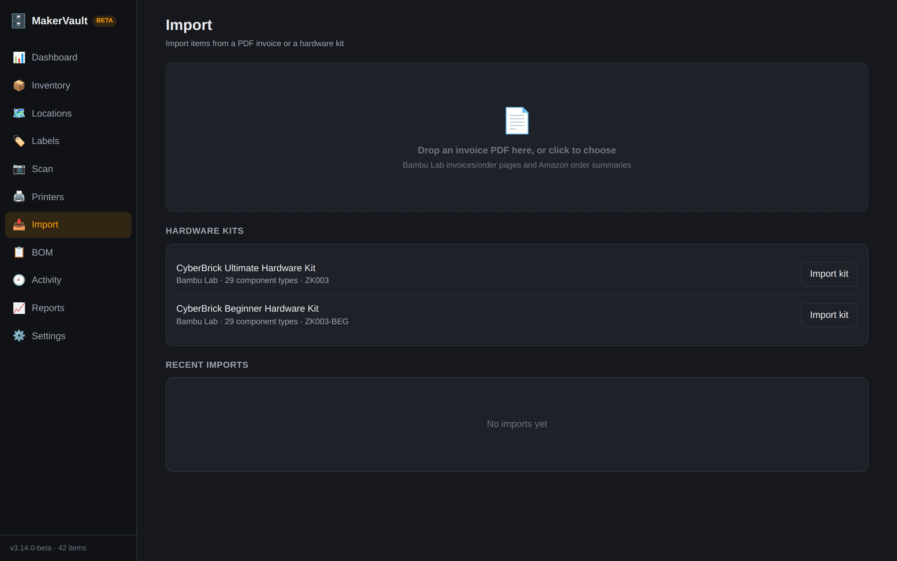

Drop a Bambu Lab or Amazon invoice PDF here. MakerVault reads it in the browser and shows every line in a table you can edit before anything is saved. Choose what to do with items you already have (add to them, skip them or create new ones), then press Import. Hardware kits are listed on the same page. See [subsystems/importing.md](subsystems/importing.md).

## BOM

Drop a Makerworld bill of materials (`.xlsx`) to see which parts you have, which you're short on and which are missing.

## Reports

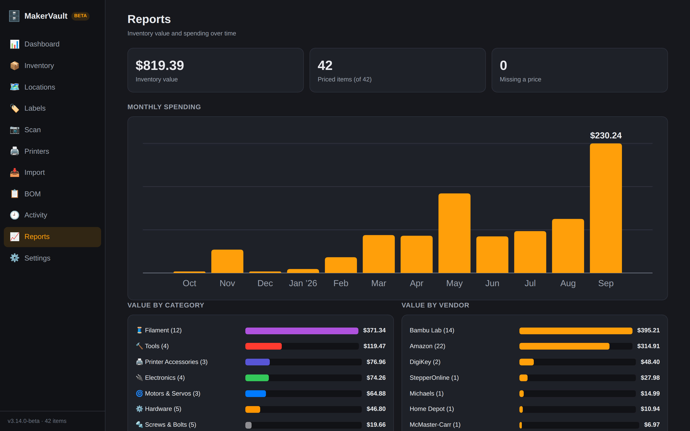

Inventory value, spending per month for the last 12 months, and value by category and by vendor. Items without a price aren't counted, and the tile at the top says how many those are.

## Activity

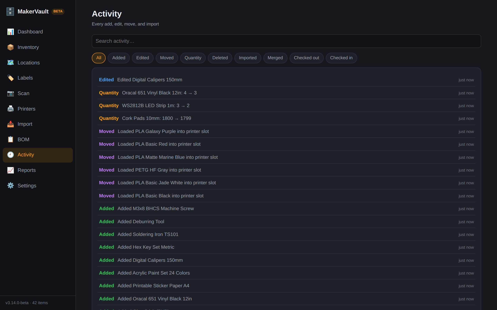

Every change, newest first. Filter by type (added, edited, moved, quantity, deleted, imported, merged, checked out, checked in) or search.

## Settings

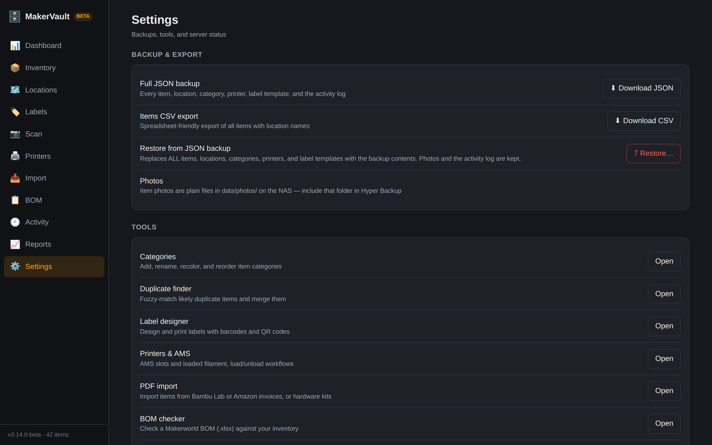

| Option | What it does |
|---|---|
| Download JSON backup | Saves most of the data to a file you can restore later. [known-issues.md](known-issues.md#backup-and-restore) lists what it leaves out. |
| Download CSV | Saves the items list for spreadsheets. |
| Restore | Replaces the current data with a backup file, after two confirmations. |
| Categories | Add, rename, recolor and reorder categories. |
| Duplicate Finder | Lists items that look like the same thing. Pick the one to keep and merge the others into it, or mark the group as not duplicates. |

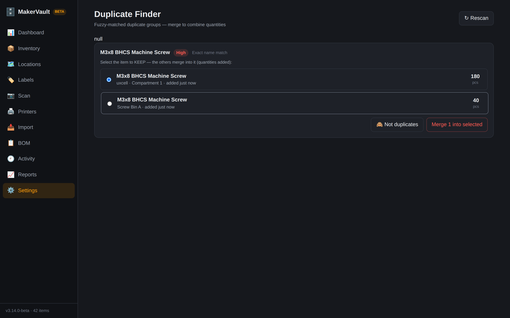
